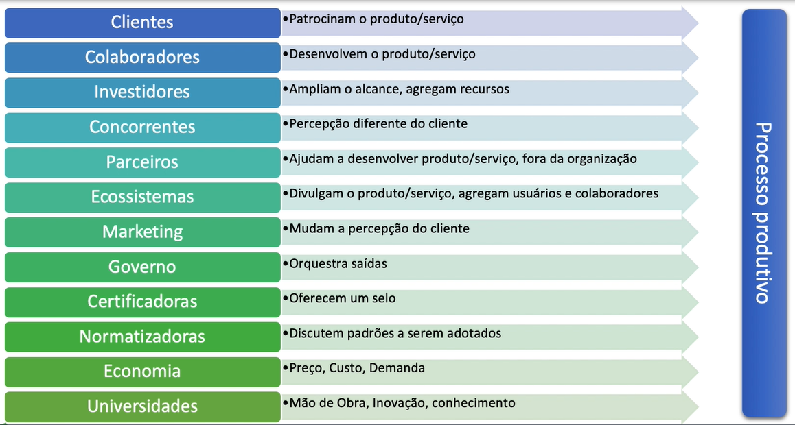
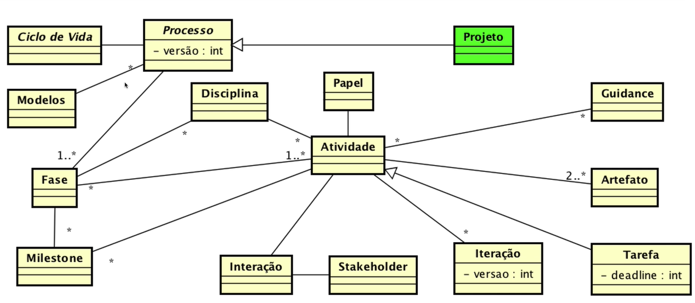
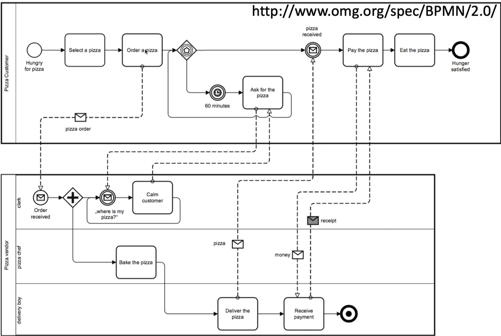
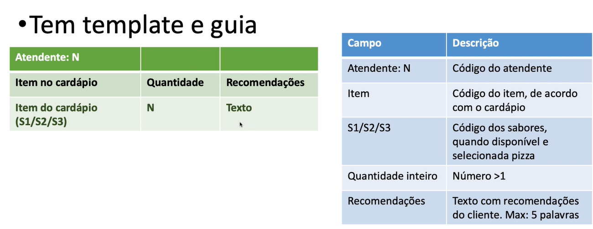
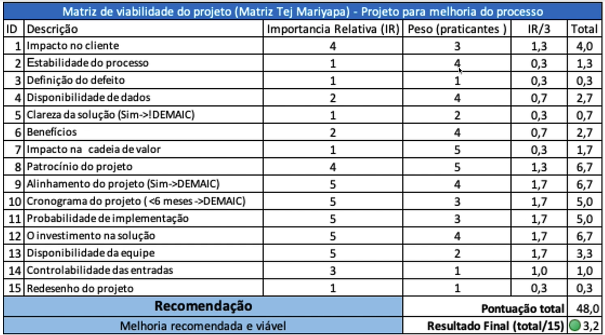
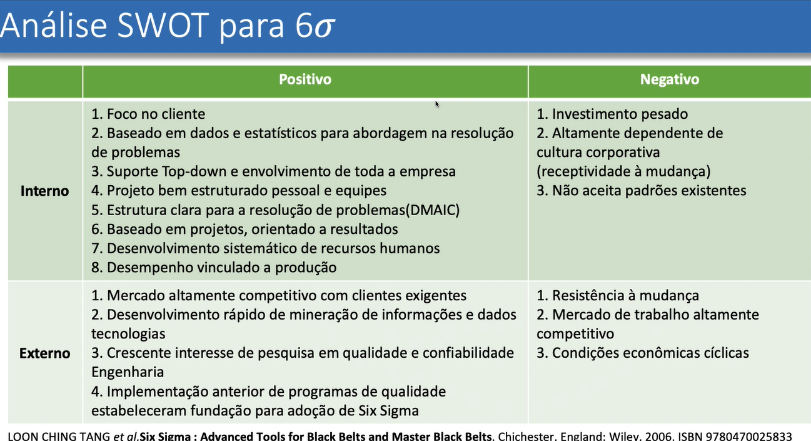
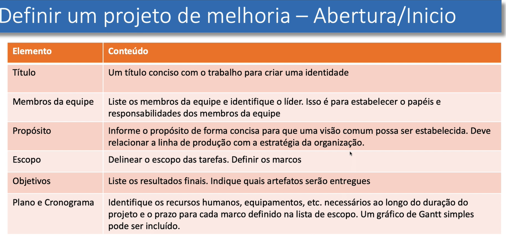

# Avaliação e Melhoria de Processo de Software

* Definições preliminares
    * O que é avaliação
        * julgamento, apreciação, análise
        * tem orientações e critérios (parâmetros com métricas)
    * O que é melhoria
        * Evoluir, aprimorar, refinar aperfeiçoar
        * Orientada por um ponto de vista
* O que é melhor depende do ponto de vista. 
    * para um jovem uma ferrari é melhor mas para um pai de familia um carro confortável é melhor
* Como melhorar
    * um motor a gasolina antes possuía um sistema a tecnologia e as peças foram alteradas porém o paradigma é o mesmo
    * É possível ainda fazer upgrades colocando turbo no motor, porém ainda continua o mesmo paradigma
    * A mudança de paradigma ocorre quando existe uma outra forma de chegar ao mesmo resultado, por exemplo um motor a bateria de carro elétrico
    * O processo de melhoria pode ser controlado com PDCA ou DMAIC
        * Define (Definir): Definir com precisão o escopo do projeto.
        * Measure (Medir): Determinar a localização ou o foco do problema.
        * Analyze (Analisar): Determinar as causas de cada problema prioritário.
        * Improve (Melhorar): Propor, avaliar e implementar soluções para cada problema prioritário
        * Control (Controlar): Garantir que o alcance da meta seja mantido a longo prazo
* Abordagem conceitual do processo de melhoria
    * Melhoria do processo de software
        * atenção com o ciclo de vida
    * Possivelmente durante este processo
        * A produção não para
        * O produto salta de um processo para o outro
        * Operadores atual em 2 ou mais processos
* Abordagem em amplitude vs profundidade
    * amplitude: melhora a relação entre as atividades e as pessoas, influencia na melhor performance.
    * profundidade: trabalha no aperfeiçoamento atividade por atividade, influencia na qualidade.
    * 
* Relação de tecnologia vs processo
    * Toda tecnologia injetada no processo de desenvolvimento de software desbalanceia o nível de padronização.
    * 

* Variabilidade nos processos
    * dispersão
    * variação
* Variabilidade está relacionada a
    * fluxo do processo (processo)
    * Institucionalização do processo
    * ferramentas
    * demandas
* Consequência: gera produtos defeituosos
* O que vamos vazer?
    * Compreender como adequar processos de acordo com demandas
    * Adequar processos de acordo com o ingresso de novas tecnologias
* Disciplina
    * capacitar o aluno a compreender um processo
        * quais seus componentes
    * capacitar o aluno a avaliar o processo
        * como identificar os parâmetros de avaliação?
    * preparar ambiente para mudança
        * como implantar o novo processo
# Aula 02

* Introdução a processos
    * conceito de processo
        * Envolve um conjunto de recursos e de insumos usados para transformar algo em bens e serviços
        * qualificado como um conjunto de atividades usadas para atingir uma determinada meta
        * Receita
    * Processo: origem formal
        * conjunto de atividades e resultados associados que produzem:
            * produto
            * serviço
    * Pensando como henry ford
        * postos de trabalho altamente especializados
        * linha de produção em massa
        * especialização de postos de trabalho: otimização para pessoas com membros amputados, por exemplo
        * "todos podem escolher comprar um carro desde que seja um ford T Preto" ford 1914
    * 1914 - Henry ford
        * Fordismo
            * sistema de produção caracterizado pela produção em massa.
            * redução do custo de produção para baratear o produto e atingir maior número de consumidores.
            * uso de esteira para padronizar o tempo de produção.
            * não necessita mão de obra qualificada
            * trabalho repetitivo e desgastante.
* Entendendo os players
    * todo e qualquer elemento que possa exercer influência
    * orientado pela estratégia competitiva
    * portanto:
        * todo e qualquer elemento pertencente ao cenário
            * governo, indústria, desenvolvedores, investidores, clientes, tenências, etc ...
* impacto dos players... exemplo aplicado
    * o único chefe é o cliente
    * mudança de paradigma
    * produção enxuta
    * mass customization
    * Taiichi Ohno
        * was a Japanese industrial engineer and businessman. He is considered to be the father of the Toyota Production System, which became lean Manufacturing in the U.S. He devised the seven wastes as part of this system.
        * Born: February 29, 1912, Dalian, China
        * Died: May 28, 1990, Toyota, Aichi Prefecture, Japan
        * Books: Toyota Production System : Beyond Large-Scale Production, Just-in-time for today and tomorrow, taiichi ohnos workplace management workplace management.
* players desta geração
    * clientes
    * colaboradores
    * investidores
    * concorrentes
    * parceiros
    * ecossistemas
    * marketing
    * governo
    * certificadoras
    * normatizadoras
    * economia
    * universidades
* análise - influencia no processo produtivo
    * 
* elementos do processo
    * ciclo de vida:
        Nascimento-> desativação, cíclico ou não
    * componentes:
        Fases, Atividades, Tarefas, Disciplinas, Artefatos, Papéis
    * Métricas:
        * MBTBR, MTBF, produto final, qtd defeitos, execuções, etc ...
    * Modelos de qualidade:
        * ISO2914110, CMMI, 6sigma, etc..
    * Histórico
    * Capacidade de "atualizar"
        * processos de melhoria contínua ...
* ciclo de vida
    * maneira na qual observamos o processo como um todo
    * abstração do processo
    * pode conter indicadores implícitos
        * problemas, métricas, etc ...
    * pode ser ( e geralmente é) híbrido
        * questão de escopo/ponto de vista
        * lembre de processo de software
            * você incluiu desativação, operação ou manutenção?
* componentes
    * Fases: segmento significante do ciclo de vida
    * Atividades: partições do processo
    * tarefas: Atividade + deadline
    * disciplinas: conjunto de atividades relacionadas
    * artefatos: work product; aquilo que é produzido
    * papéis: quem executa o trabalho
    * guidance: templates, checklists, exemplos, guidelines, etc
    * interações: comunicação com stakeholders
    * Iterações: repetição de atividades
    * milestones: marco no projeto, pode incluir entrega
    * ferramentas: instrumento utilizado na execução do trabalho
    * feedback: retroalimentação
* Exemplo de abordagem
    * 
* métricas e parâmetros de monitoramento
    * dinâmica: sobre influência forte da estratégia
    * métricas do processo
        * quanto tempo levo para produzir um carro?
        * tempo / atividade
        * custo / atividade
    * métricas do produto
        * qual o peso do carro?
        * loc
        * pontos por função
* histórico - monitoramento do processo
    * "coleção temporal de métricas"
    * pode ser arbitrária: depende da estratégia
    * ampara métricas: atualizações, etc
    * contém a relação unitária / objeto
        * loc -> loc/perfil de programador
        * n. de erros
        * etc.
* modelos
    * amparo para padronização universal
        * criar processos dentro de escopos predefinidos
        * monitorar processos
        * avaliar processos
        * análise e ajustes para a implantação e institucionalização
* melhoria contínua
    * lean
    * 6sigma
    * kaizen
    * perpetual beta
    * etc.
* Porque falhamos...
    * negligenciamos a estratégia
        * pessoas + produtos + processos ( por marcus lemonis)
    * criamos estruturas desnecessárias
        * conduzimos a produção equivocadamente
    * não criamos estruturas necessárias
        * condução ad-hoc da produção
    * O cenário é dinâmico: mudanças constantes
        * O que é útil hoje talvez não seja amanhã
        * Exemplo: mimeógrafo
    * Mudanças
        * novos nichos-> novas regras de negócios
* Definições para nossa disciplina
    * quanto um processo é documentado e institucionalizado chamados de processo formalizado.
        * definição específica da disciplina
* próximos desafios
    * especificar e documentar processos
    * mensurar e avaliar processos
    * implantar e institucionalizar processos

# Aula 03
* Definir o problema em um processo é a parte crítica do sucesso,
* Assim como requisitos em software:
    * Mal definido
        * Pode desencadear uma sequencia de trabalhos desnecessários
        * Pode comprometer a viabilidade do processo
* Necessário para qualquer abordagem de melhoria de processo:
    * Amplitude (exemplo Lean)
    * Profundidade (exemplo: seis sigma)

* Busca compreender elementos chaves dos players
* Atividades desenvolvidas
    * Mapeamento e documentação do processo
        * utilizar bpmn, por exemplo
    * Definir critérios de análise
    * Análise SWOT
* Mapeamento e documentação de processo
    * O processo precisa ser compreendido e documentado
    * Problemas mais simples são identificados durante o mapeamento
    * Este mapeamento será utilizado para identificar o processo de metrificação
    * Ferramenta sugerida: Probuilder
* Exemplo

    

* O que documentar em um processo
    * Todas as atividades devem ser relatadas
    * Exemplo: bake the pizza
    * Tem entradas: Pedido
    * Tem saídas: Pizza assada
    * Tem responsável: pizza chef
* Bake the pizza documentando a entrada

    

* Além do documento de entrada deve haver também um documento com o procedimento operacional 
    * especificar o passo a passo para construir tal pizza. 

* Análise dos players
    * Compreender a influencia e o posicionamento do processo é uma necessidade
    * Direciona os esforços  para  a melhoria em amplitude e/ou em profundidade
    * Ferramenta recomendada: Análise SWOT

* Análise - Primeiro diagnostico - SWOT
    * Pontos fortes: fomentam vantagens estruturais competitivas de uma empresa
    * Pontos fracos: deficiências são estruturais e identificadas em relação as empresas concorrentes.
    * Oportunidades: referem-se as forcas ambientais externas e incontroláveis que favorecem as ações de uma empresa
    * Ameaças: podem comprometer a vantagem competitiva da empresa, pois representam obstáculos se não forem reconhecidas em tempo hábil.

* Melhorar o processo - Como iniciar    
    * Pode ser uma modificação simples ou NÂP !!!
    * É viável melhorar o processo?
    * A matriz de 15 critérios-chave de seleção de Tej Mariyapa é uma ferramenta para definir:
        * Se utilizar ou não o Six Sigma (DMAIC)
* Critérios de análise - Definir o nível de interferência
    1. Impacto no cliente - o projeto, se melhorado com sucesso, tem um impacto no cliente?
    2. A estabilidade do processo foi ou atingiu um nível estável de desempenho?
    3. Definição do defeito - podemos definir o defeito operacional do processo? ( taxas de erro, taxas de retrabalho, porcentagem de atendimento, prazos de entrega e taxas de reclamação)
    4. Disponibilidade de dados, podemos obter dados sobre o processo. Métricas?
    5. Clareza da solução. Se nós conhecemos a solução? (Se esse é o caso, o projeto não precisa de DMAIC)
    6. Benefícios, quais são os custos-benefícios e benefícios suaves (relacionado à satisfação do cliente) de um processo aprimorado?
    7. O impacto na qualidade do serviço contribuirá para a melhoria ao longo da cadeia de valor?
    8. O patrocínio do projeto. A diferença entre o sucesso e fracasso são suficientemente importantes? ( um patrocínio forte é um pré-requisito para six sigma)
    9. Alinhamento do projeto. O projeto é alinhado com os objetivos da empresa? ( se não, não é viável)
    10. Cronograma do projeto. Quanto tempo precisamos para a conclusão da melhoria? (mais de 6 meses não é um tempo razoável período para DMAIC)
    11. Probabilidade de implementação. A solução para o projeto pode ser implementado sem alta resistência / alto custo/ corporativo mudança?
    12. O investimento na solução de melhoria será grande? ( se for assim, six sigma pode não ser a metodologia a ser usada)
    13. Disponibilidade da equipe - Os membros da equipe têm tempo suficiente para apoiar o projeto?
    14. Controlabilidade das entradas, podemos avaliar se temos entradas mensuráveis e controláveis? (é difícil abordar um projeto se não tivermos controle sobre as entradas)
    15. Redesenho do projeto - podemos melhorar o processo sem redesenha-lo? (caso contrário, a viabilidade do projeto é baixa para DMAIC)

* Como aplicar a matriz
    * Cada elemento pontuado de 1 a 5 ( 1 menos importante 5 mais importante)
    * Atribuir um peso para cada critério (também de 1 a 5)
    * Após efetuar os cálculos:
        * Menor que 2: O projeto não é um projeto DMAIC viável; isto pode ser melhorar usar outra abordagem
        * Entre 2.0 e 3.0 - Este é um possível projeto DMAIC;vai exigir validação posterior.
        * Maior que 3.0 - Este é um projeto DMAIC viável.

    

    

    

