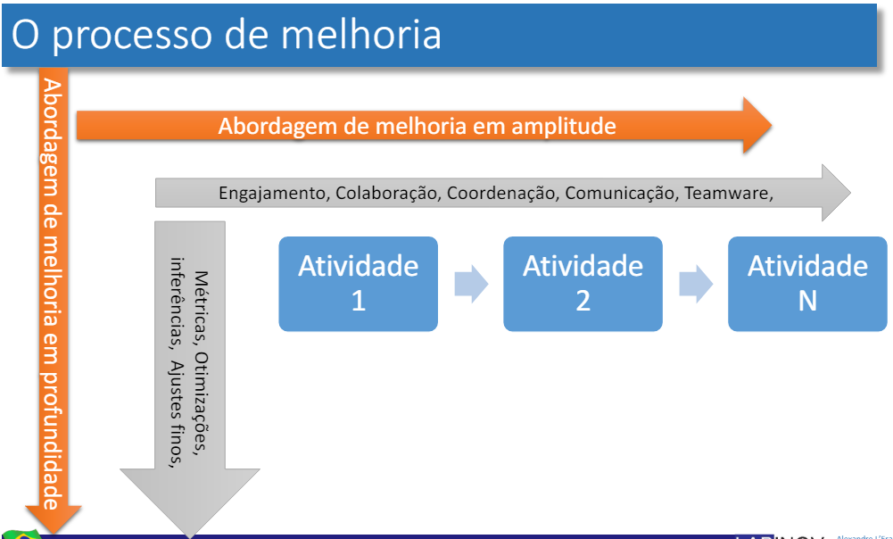
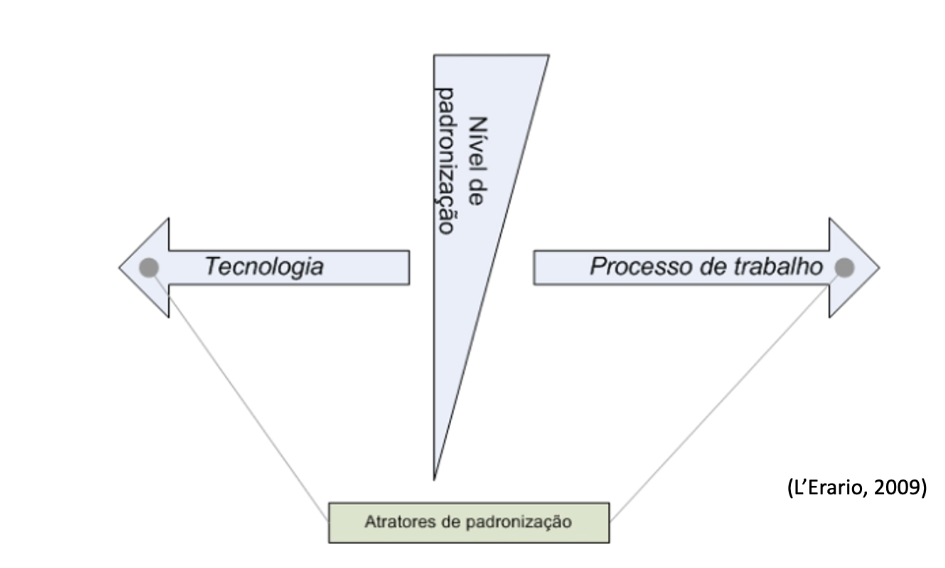

# Avaliação e Melhoria de Processo de Software

* Definições preliminares
    * O que é avaliação
        * julgamento, apreciação, análise
        * tem orientações e critérios (parâmetros com métricas)
    * O que é melhoria
        * Evoluir, aprimorar, refinar aperfeiçoar
        * Orientada por um ponto de vista
* O que é melhor depende do ponto de vista. 
    * para um jovem uma ferrari é melhor mas para um pai de familia um carro confortável é melhor
* Como melhorar
    * um motor a gasolina antes possuía um sistema a tecnologia e as peças foram alteradas porém o paradigma é o mesmo
    * É possível ainda fazer upgrades colocando turbo no motor, porém ainda continua o mesmo paradigma
    * A mudança de paradigma ocorre quando existe uma outra forma de chegar ao mesmo resultado, por exemplo um motor a bateria de carro elétrico
    * O processo de melhoria pode ser controlado com PDCA ou DMAIC
        * Define (Definir): Definir com precisão o escopo do projeto.
        * Measure (Medir): Determinar a localização ou o foco do problema.
        * Analyze (Analisar): Determinar as causas de cada problema prioritário.
        * Improve (Melhorar): Propor, avaliar e implementar soluções para cada problema prioritário
        * Control (Controlar): Garantir que o alcance da meta seja mantido a longo prazo
* Abordagem conceitual do processo de melhoria
    * Melhoria do processo de software
        * atenção com o ciclo de vida
    * Possivelmente durante este processo
        * A produção não para
        * O produto salta de um processo para o outro
        * Operadores atual em 2 ou mais processos
* Abordagem em amplitude vs profundidade
    * amplitude: melhora a relação entre as atividades e as pessoas, influencia na melhor performance.
    * profundidade: trabalha no aperfeiçoamento atividade por atividade, influencia na qualidade.
    * 
* Relação de tecnologia vs processo
    * Toda tecnologia injetada no processo de desenvolvimento de software desbalanceia o nível de padronização.
    * 

* Variabilidade nos processos
    * dispersão
    * variação
* Variabilidade está relacionada a
    * fluxo do processo (processo)
    * Institucionalização do processo
    * ferramentas
    * demandas
* Consequência: gera produtos defeituosos
* O que vamos vazer?
    * Compreender como adequar processos de acordo com demandas
    * Adequar processos de acordo com o ingresso de novas tecnologias
* Disciplina
    * capacitar o aluno a compreender um processo
        * quais seus componentes
    * capacitar o aluno a avaliar o processo
        * como identificar os parâmetros de avaliação?
    * preparar ambiente para mudança
        * como implantar o novo processo
